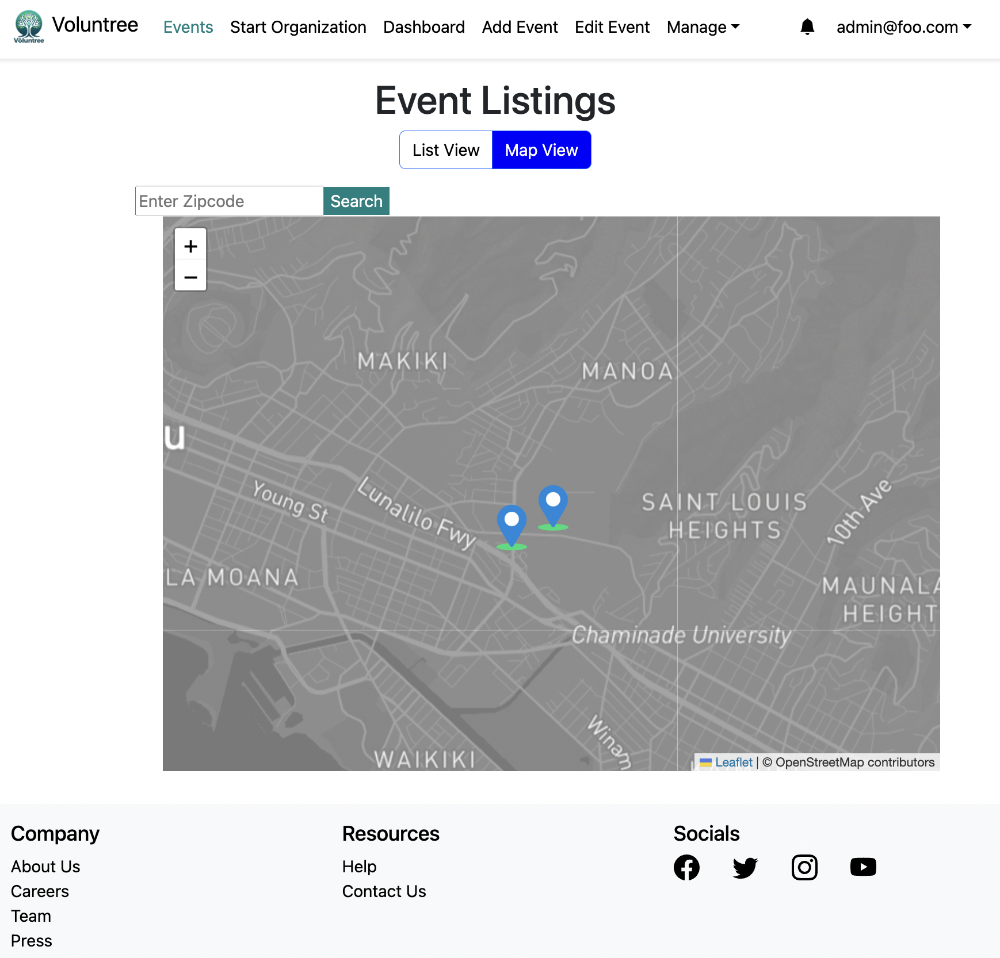
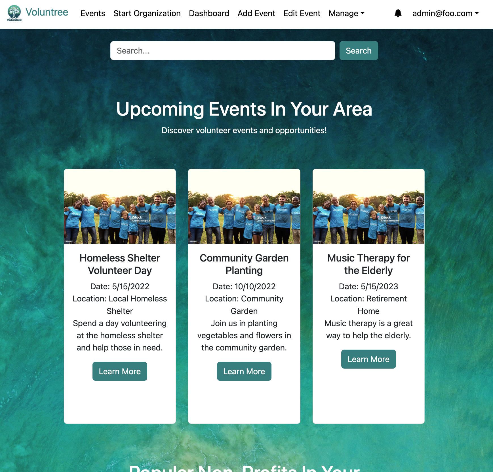

### Getting Started

In the spring of 2024 I embarked taking the 'Software Engineering II' class at my University. I throughouly 
enjoyed Software Engineering I. This class aimed to teach students basic design principals and a MongoDB, React, and Meteor Stack.
Software Engineering II added to what students learned in the first class. The class broke students into groups to 
work on a large website project together using Meteor. For the semester I was assigned to team Octagon. Our team originally was comprised of eight people. However within
the first few weeks our team shrunk to six people. For this spring we were tasked with building a volunteering social platform.
A website that intergrated people wanting to volunteer with organizations. The project had a list of requirments and 
multiple deadlines throughout the semester.

### Our Project

  

  

For the start of the project we got started with a lot of backend work. The thought was if we put in some time now 
doing some boring stuff the application will scale later in the semester making development easier. I think we 
missed the mark doing this personally. Because the result was in the beginning of the semester we did not make much
visable progress. Towards the end it was hard to catch up on the design of the website and specific features. If the 
project was larger and we had a longer time period I think the work we did in the beginning would have made more sense.
This is not to say we didn't get a lot done. We were able to implement some cool features such as a map for viewing events, a
chat system, and a notifications system. The map system was interesting for me to implement. Because I learned a lot along the
way. For starters when I type in an address I had no idea you must first correlate it to a latitude and longitude location.
This is so it can be properly displayed on the map, because the map has no idea of addresses only latitude and longitude. I learned 
about about geocoding and the services on the market currently for this. As well how expensive it can be to use this services
on a large commercial level. Overall the project brought the team many technical challeges however it was very rewarding to have a 
rough finished product by the end of the sememster and to work with such a large code base. 

### The Team

As stated earlier, the team started with eight team members and within the first few weeks we were down to six. From here
only four of us contrbuted to the project over the semester, so it was like seeing our team get cut in half. This was by far 
the biggest challege we as a team faced. Being down team members and working mostly on backend engeineering in the beginning
of the semester lead to us being behind our classmates in terms of visuals and features of the project. As a team we accepted 
this as a fact and towards the end of the semester we focused in on the essential features. Besides this large setback the 
team worked well together. With the rest of us contributing to parts of the project we believed to be important. We 
all helped each other out answering questions and were responsive within discord. With our communication being clear and 
professional. I'm happy with the results we achilved given the circumstances.

### Final Thouhgts
Overall I had a great experience with this class. I worked with the largest code base I have ever worked with. Had 
interesting dialog with team members and got a sense of satisfaction from the finished product. It was inspirring seeing
how much our small team got done. In the future I think it will motivate me to work more on persoanl projects and I will
be able to take lessons learned from the class and apply it. I'd reccommend other students to take the course and try
building a web app with their fellow ICS classmates. I hope to look back at the project in the furture and see how far 
I have come within the software engineering world. Finally I'd like to thank Moore for offering the class and guideance throughout 
the sememster.

