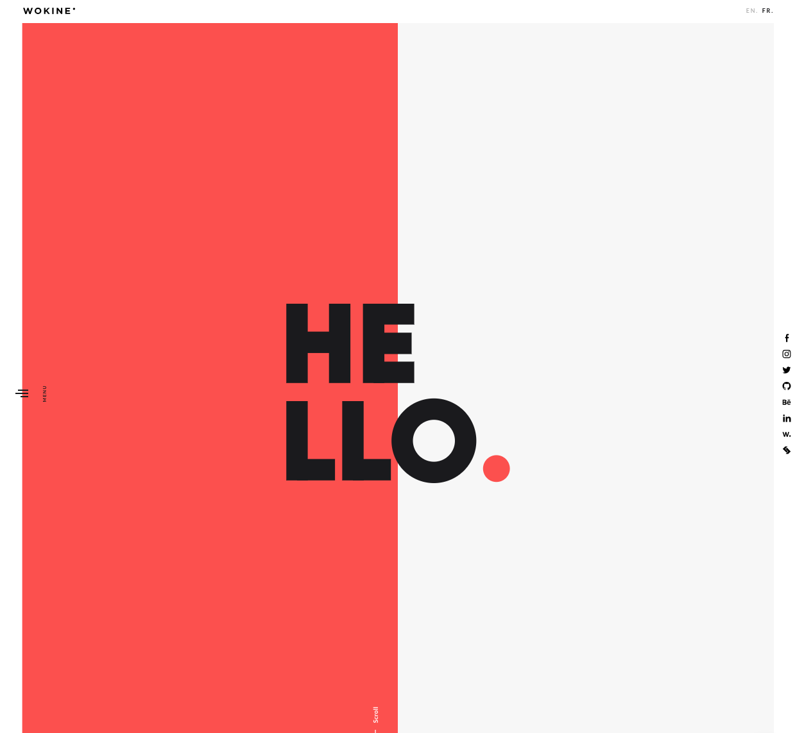

### Overview
With the continued developing complexity of web development developers now must learn multiple frameworks and tools in addition to languages to make stand out webpages. Specifically new web user interface frameworks are being released constantly. However, household names such as Bootstrap, Material UI, and Tailwind still make up for the majority of developers front end frameworks. Each new framework has to each their own learning curves. In exchange the developer expects an easier approuch to styling from the standard CSS/HTML. This comes at the expense of flexibity and creative freedom. With more webpages being built with frameworks, it makes it more difficult to build websites with frameworkds that stand out. The question stands "Is it worth learning UI frameworks in 2023"?

### Justifying the Need for UI Frameworks
For developer's frameworks aim to create efficenty in web developement, minimizing the time investment and complexity of building sites with css. To this, they are great. Frameworks allow developer without much front end knowledge to get up and building beautiful website's right away. This of course comes at the expense of flexibity and results in some cases cookie cutter website's that appear to be build by templates. At some level all UI frameworks are glorified web templates and have their limitations. Nevertheless they are valueable tools with use cases. They are valueable for specifically building internal company pages, contnet management systems, and pages which need repetative and consistant styling. Because of this, every developer should be comfortable working with at least one framework.

### What's to Love About CSS
Many developers, mostly backend focused developers find frustration using CSS to build sites. But for the creative developers it is a necesity that must be learned and mastered to make use of the technology. It offers full creativity and developers should be confortable understanding the inter workings of CSS if they are to learn frameworks. While it is frustrating for most, it is the backbone of frameworks and allows for customization when needed. Because of this, developers should not skip over CSS and instead learn fundamentals of how it works to help their development.

### Comparing UI Frameworks to CSS
We have learned when to use Frameworks and CSS. Now let's take a look at three sites built with bootstrap, or just plain css.

  

  

  

