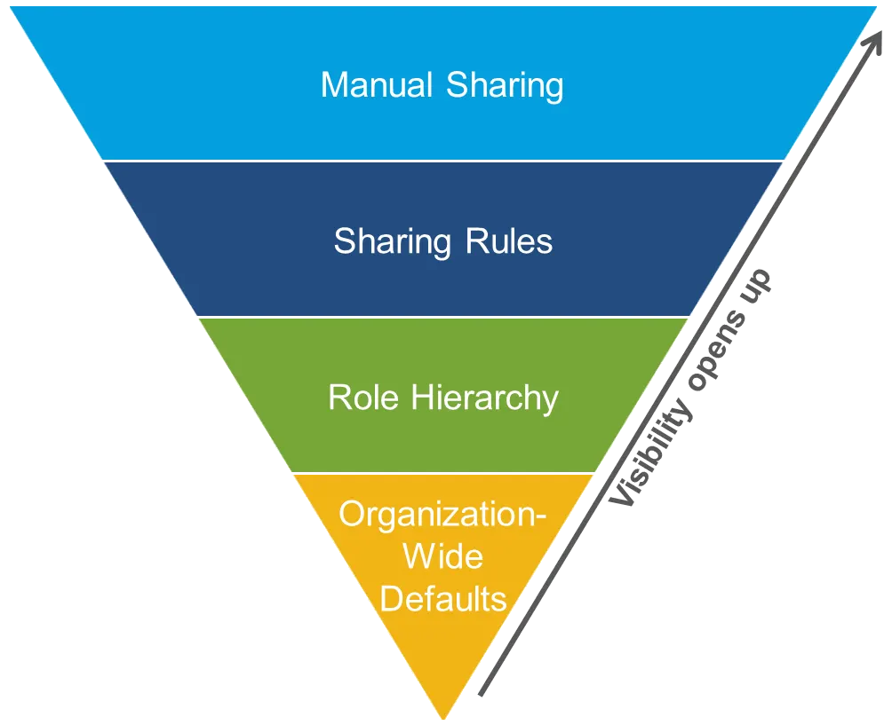

### Objective One

The first objective was to build a central document in Excel which contained every user, permission set, public group, and profile. 
Using Apex, SOQL, and Excel power query we imported all this data which included 140,000+ rows of data. The data was then organized by data type.

### Object Two

From there the data was analyzed with this easy to view document. Data access which stuck out was noted to be updated in the future. In total over 200+ permission sets were changed which contained 130,000+ different field level access levels. 

### Objective Three

Finally all the changed made in the central document were made in a Salesforce sandbox which was later merged with the production Salesforce environment. 

### Impact

The work resulted in increased security in the Salesforce Platform PCM uses. More importantly standardization was added to make future changes easier to read and understand.

Image source: <a href="https://developer.salesforce.com/blogs/developer-relations/2017/04/salesforce-data-security-model-explained-visually">link</a>
