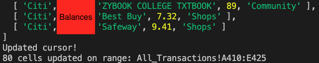
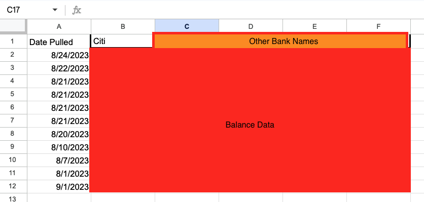
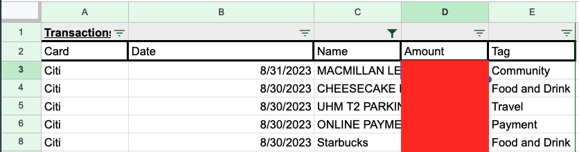
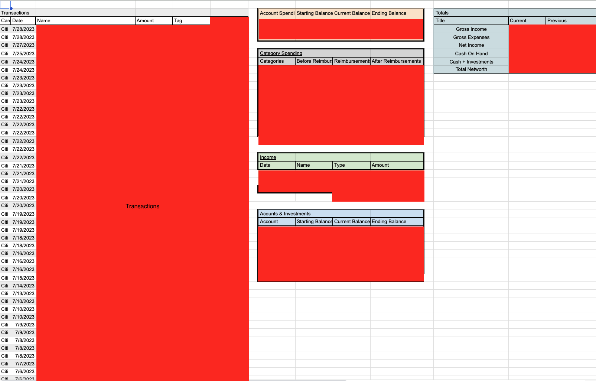

After trying many different finance tracking methods such as Intuit Mint, YNAB, Rocket Money, Notion, and writing it out on paper every month I realized most are either time consuming to use and track finances, or offer no flexability. I found Excel/Google Sheets to be the best in terms of flexibility, however entering every tranaction manually is time consuming and annoying. Because of this I decided to create a tool to automatically sync your bank transactions and balances into Google Sheets. This way you have all the data Fiannce tracking apps such as Mint have access to, but you can customize your Google sheet to include or exclude data in a format that works for you.

 

### Technologies Used
To Build this application I used NodeJS as the main technology. This is becuase for the two API's I used Javascript had the most documention. The application makes use of <a href="https://developers.google.com/sheets/api/guides/concepts">Google Sheets API</a>. Google Sheets is a free alternative to Microsoft Excel that is entirely hosted online. The API is provided from Googles Cloud console. It allowed me to login any Google account and update different sheet data through code. Secondly <a href="https://plaid.com/">Plaid's transactions and balance API</a> was used. Plaid is a fintech company that speciflices in retriving data from thousands of banks. They offer free access to 100 connected accounts. With these technologies I was able to build Javascript scripts. 

 
### "Server.js"
The first one called "server.js" initializes the Plaid client and hostes the login screen for plaid on localhost:3000. Once the user goes to the page and logs into their bank through plaid the access key to their account is logged into the console and it is stored into a .env file. 

### "DailyUpdate.js"
With this information "DailyUpdate.js" can be ran whenever I or someone wants to update the transactions and balance data in Google Sheets. On the first run it will ask you to sign into your google account to get access to the Google sheet. With "DailyUpdate.js" it can be set on a cron job either on a local machine or online through circle.ci or other services to run at a set time daily. The Javascript file makes an API call to get all your banks transactions and balance data, it then inserts this data into the specificed Google Sheet.
 
### Example Console Output

### Data Imported to Google Sheets

These are the two sheets I have the API dump my data into. From here I use Google's Appscript to automatically create a new statement every month that does calculations such as total spending etc. 
 

### Tracker Example
Below is an example of how I have made a customer tracker statement that includes the various data I find important. This can be customized for different use cases such as including total asset and debt tabs. 
 

 
Source code and repo coming soon after more testing. So you can make your own automatic custom finance tracker!

